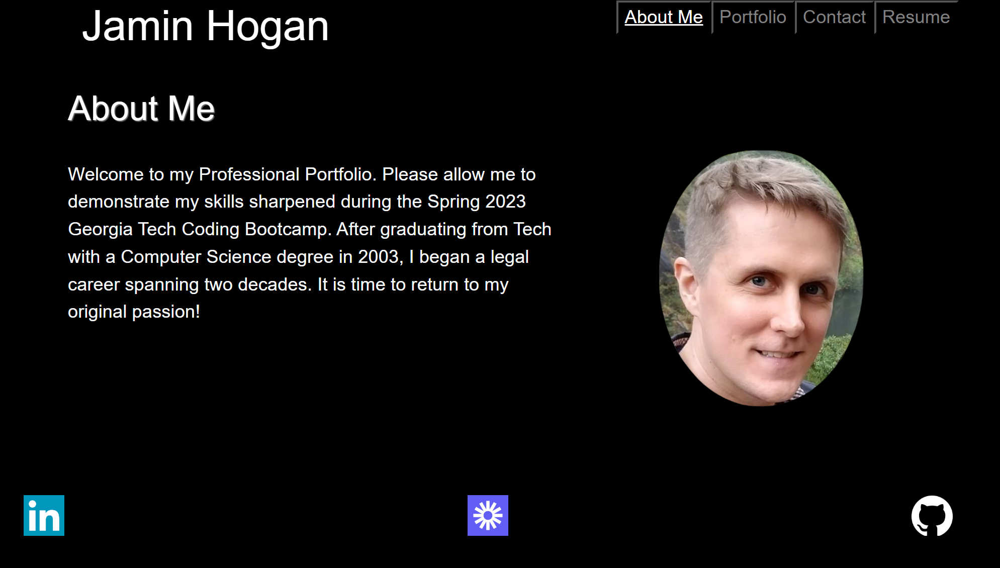
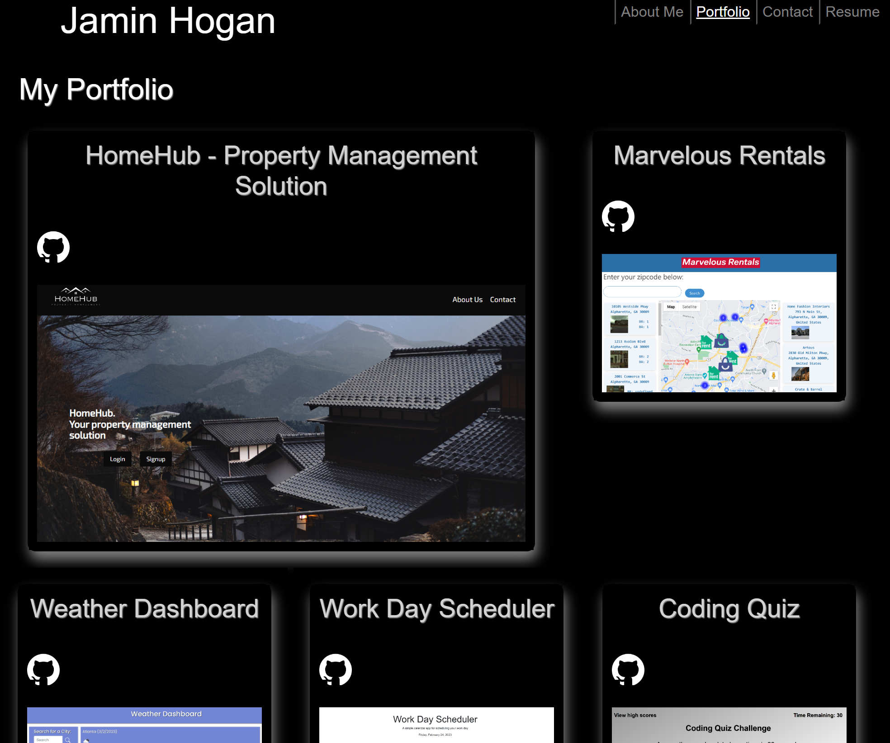
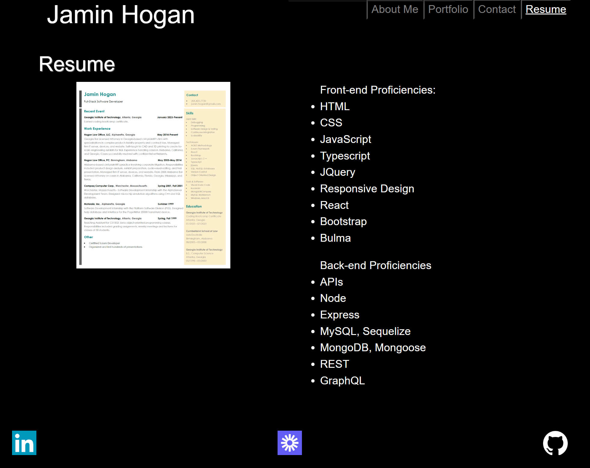

# React-Portfolio

## Description
    
This Project is my React Project Portfolio page highlighting my skills. It is built with javascript, React, and Bootstrap. It uses the following libraries: react, react-dom, react-scripts, web-vitals, and bootstrap.
    
## Installation

Users will need to install the npm libraries as defined in the included package.json file. 
The Set-Up CLI Commands from project root directory:
>npm i  

## Usage

Server is initialized from command line with:
>npm start

Screenshots of the program in use:
  
  

## License

This Project is covered by the following license: GNU General Public License v3.0.

## Contributions

I leaned heavily on previous work and assignments, including the miniproject as well as prior activities. My purpose was to further familize myself with the various ways to implement the required REACT functionality.

Instruction was provided by Instructor Saurav with assistance from TAs Andreas #1, Andreas #2, Constan, and Morgan. Shout out to AJ who helped me with a formatting issue.

## Tests

The Project may tested using the installation instructions above and running 'npm start' and then opening <http://localhost:3000> in any browser. The live site is available at: <https://calm-headland-52008.herokuapp.com/>.

## Questions

My GitHub username is JaminHLO and my repository is available here: <https://github.com/JaminHLO/>.
If you have any questions please contact me at <jamin.hogan@gmail.com>.
